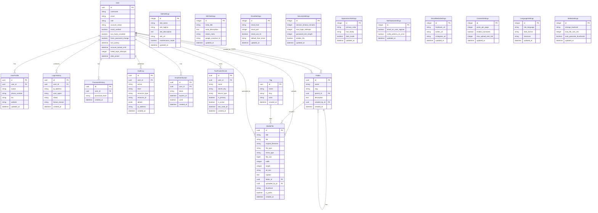

# ERD - Kabulhaden CMS

```mermaid
erDiagram
    User ||--o{ UserProfile : has
    User ||--o{ LoginHistory : produces
    User ||--o{ PasswordHistory : has
    User ||--o{ AuditLog : generates
    User ||--o{ EmailVerification : has
    User ||--o{ TwoFactorDevice : owns
    User ||--o{ MediaFile : uploads
    User ||--o{ Folder : creates

    User {
        uuid id PK
        string username
        string email
        string role
        string account_status
        boolean email_verified
        boolean two_factor_enabled
        boolean force_password_change
        datetime last_activity
        datetime account_locked_until
        integer failed_login_attempts
        datetime date_joined
    }

    UserProfile {
        uuid id PK
        uuid user_id FK
        string avatar
        string phone_number
        string bio
        string website
        datetime updated_at
    }

    LoginHistory {
        uuid id PK
        uuid user_id FK
        string ip_address
        string user_agent
        string status
        string failure_reason
        datetime created_at
    }

    PasswordHistory {
        uuid id PK
        uuid user_id FK
        string password_hash
        datetime created_at
    }

    AuditLog {
        uuid id PK
        uuid user_id FK
        string action
        string level
        string resource_type
        string resource_id
        jsonb details
        string ip_address
        datetime created_at
    }

    EmailVerification {
        uuid id PK
        uuid user_id FK
        string token
        datetime expires_at
        boolean used
        datetime created_at
    }

    TwoFactorDevice {
        uuid id PK
        uuid user_id FK
        string name
        string secret_key
        string device_type
        boolean is_primary
        boolean is_active
        datetime last_used_at
        datetime created_at
    }

    SiteSettings {
        integer id PK
        string site_name
        string site_tagline
        text site_description
        string site_url
        boolean maintenance_mode
        datetime updated_at
    }

    SEOSettings {
        integer id PK
        string meta_title
        text meta_description
        string robots_meta
        string google_analytics_id
        datetime updated_at
    }

    EmailSettings {
        integer id PK
        string email_host
        integer email_port
        boolean email_use_tls
        string default_from_email
        datetime updated_at
    }

    SecuritySettings {
        integer id PK
        integer session_timeout_minutes
        integer max_login_attempts
        integer password_min_length
        boolean enable_2fa
        datetime updated_at
    }

    AppearanceSettings {
        integer id PK
        string primary_color
        string font_family
        boolean dark_mode
        datetime updated_at
    }

    NotificationSettings {
        integer id PK
        boolean email_on_user_register
        boolean notify_admins_on_error
        datetime updated_at
    }

    SocialMediaSettings {
        integer id PK
        string facebook_url
        string twitter_url
        string instagram_url
        datetime updated_at
    }

    ContentSettings {
        integer id PK
        integer posts_per_page
        boolean enable_comments
        integer max_upload_size_mb
        datetime updated_at
    }

    LanguageSettings {
        integer id PK
        string site_language
        string date_format
        string timezone
        datetime updated_at
    }

    MediaSettings {
        integer id PK
        string storage_backend
        integer max_file_size_mb
        boolean auto_generate_thumbnails
        datetime updated_at
    }

    Folder ||--o{ MediaFile : contains
    Folder ||--o{ Folder : has
    Folder }o--|| User : created_by
    Tag }o--o{ MediaFile : tags
    MediaFile }o--|| User : uploaded_by

    Folder {
        uuid id PK
        string name
        string slug
        uuid parent_id FK
        text description
        uuid created_by_id FK
        datetime created_at
    }

    Tag {
        uuid id PK
        string name
        string slug
        string color
        datetime created_at
    }

    MediaFile {
        uuid id PK
        string title
        string file
        string original_filename
        string file_type
        string mime_type
        bigint file_size
        integer width
        integer height
        string alt_text
        text caption
        uuid folder_id FK
        uuid uploaded_by_id FK
        string thumbnail
        boolean is_public
        datetime created_at
    }
```
